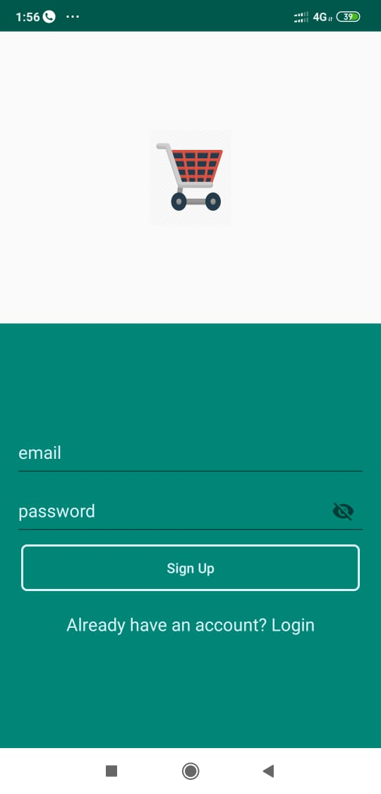
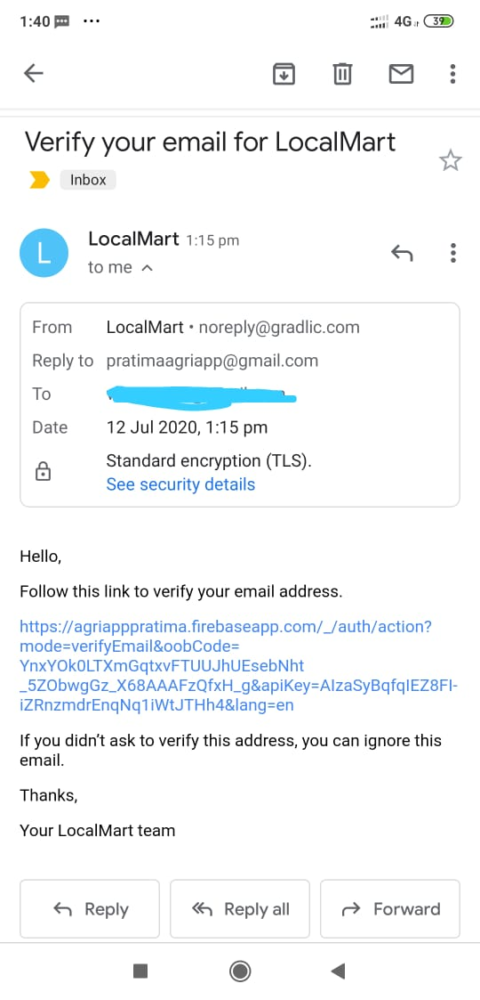
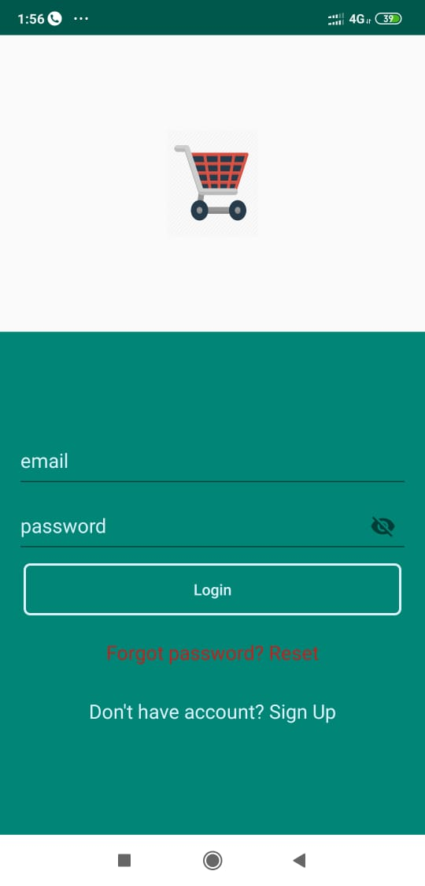
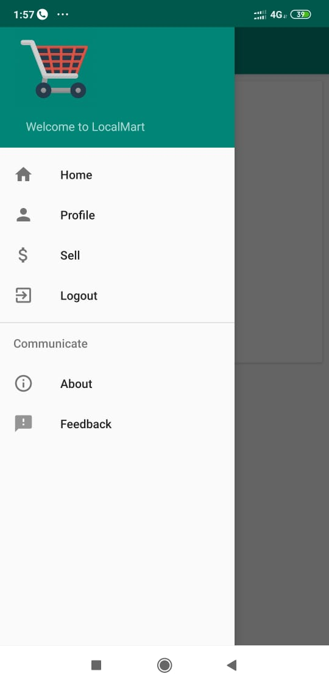
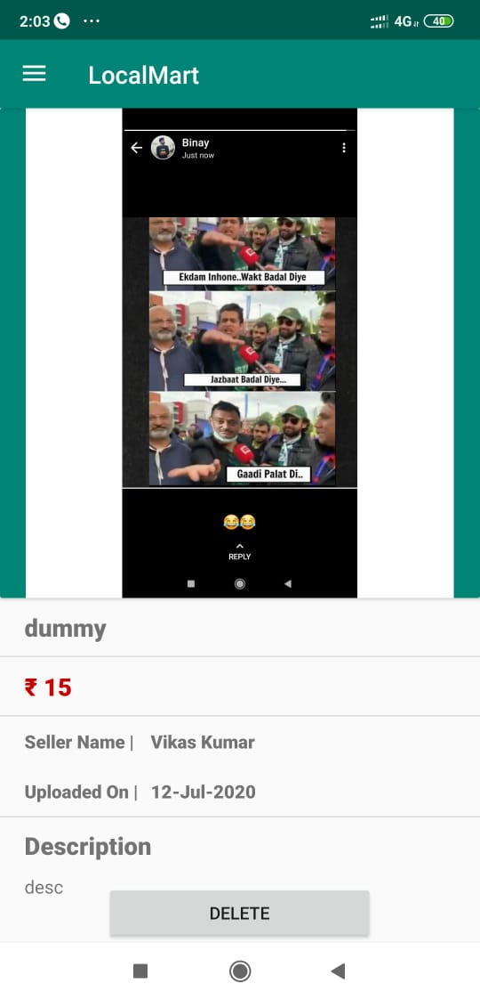
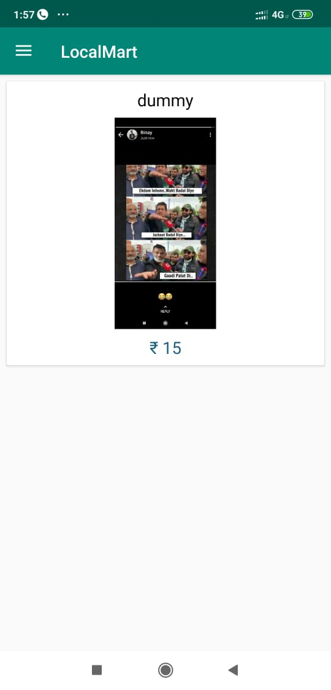
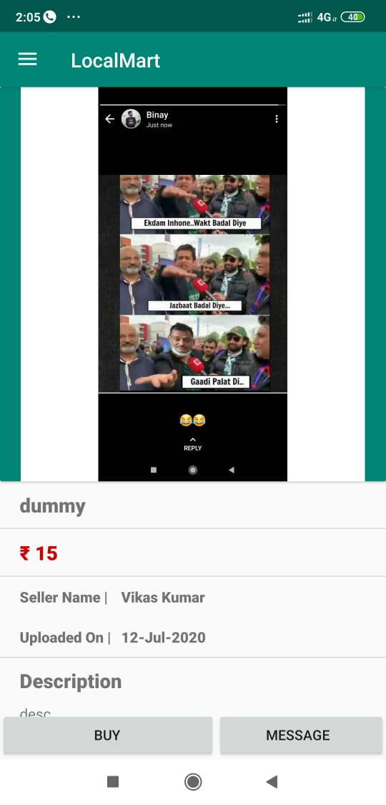
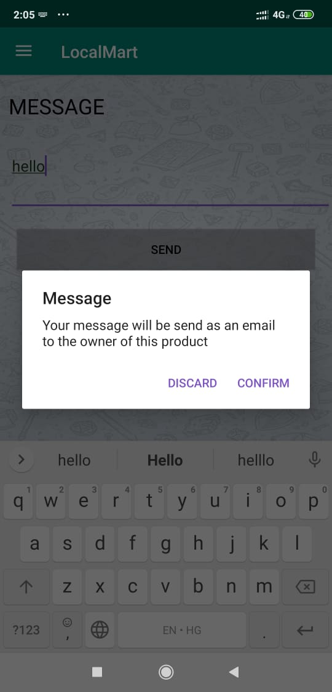
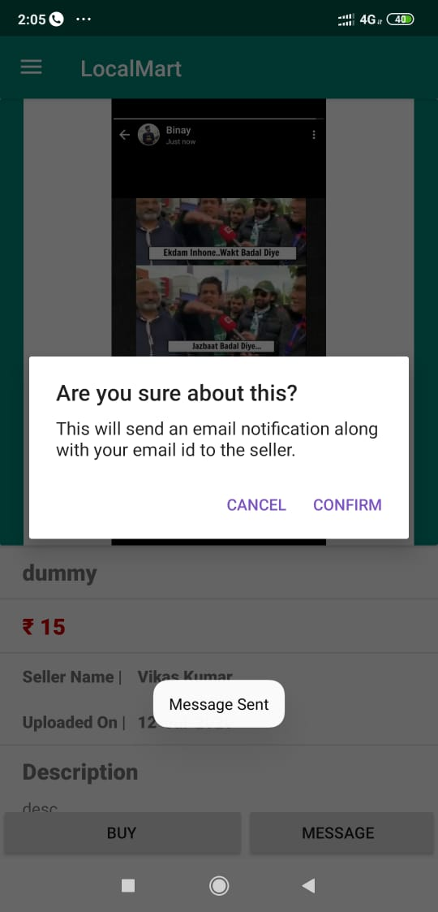

## Tools and Technology
- Android Studio
- Firebase
- Java 8

## Build Config
- Api 23: Android 6.0(marshmallow)
- Gradle: 3.2.0

## Screenshots

#### 1. Signup

#### 2. Email verification

#### 3. Login

#### 4. Navigation Drawer

#### 5. Delete Product

#### 6. Home Page

#### 7. Select Item

#### 8. Send email message

#### 9. Buy

## Demo
[Download apk](https://github.com/gradlicacademy/farmer-agriculture-android/blob/master/app-debug.apk)

Auto-reply email and email-notifications are disabled. To enable it go to Config.java file and provide email id and password.

